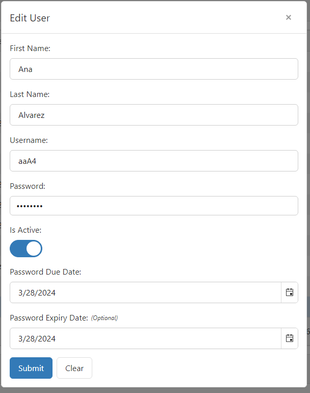

# UserAppUI
Welcome to the User Management Application

## Main Features
*Create:* Add new users to the system by providing necessary details such as name, username, etc.
*Read:* View the list of existing users along with their details.
*Update:* Modify user information such as name, or any other relevant data.
*Delete:* Remove users from the system as needed.

## How to use:
Clone repoitory and run the next commands:
```
npm i
npm run serve
```
The wait few seconds and you can see the user interface with next components:
Table with all created users the limit to list is 13 users:


Card to read user Data with the necessary information of a specific user.


And edit or delete a user information.
Form to Add and edit user infrmation, if you select a user you can edit the information of it with th enext form:


To Create a user first click on "Add User" button and thenn appear:


The form validate empty fields.

If created and edit was successful it show an alert with successful message.

For Delete user after click on it the confirmation alert appear to confirm the action.

**Note** After create, Edit or Delete some user the table was reload automatically.


## Other
[Views](https://www.figma.com/files/recents-and-sharing/recently-viewed?fuid=1120026231202555312)
[UI Repository](https://github.com/CamilaM16/UserAppUI.git)
[Backend Repository](https://github.com/CamilaM16/UserApp.git)